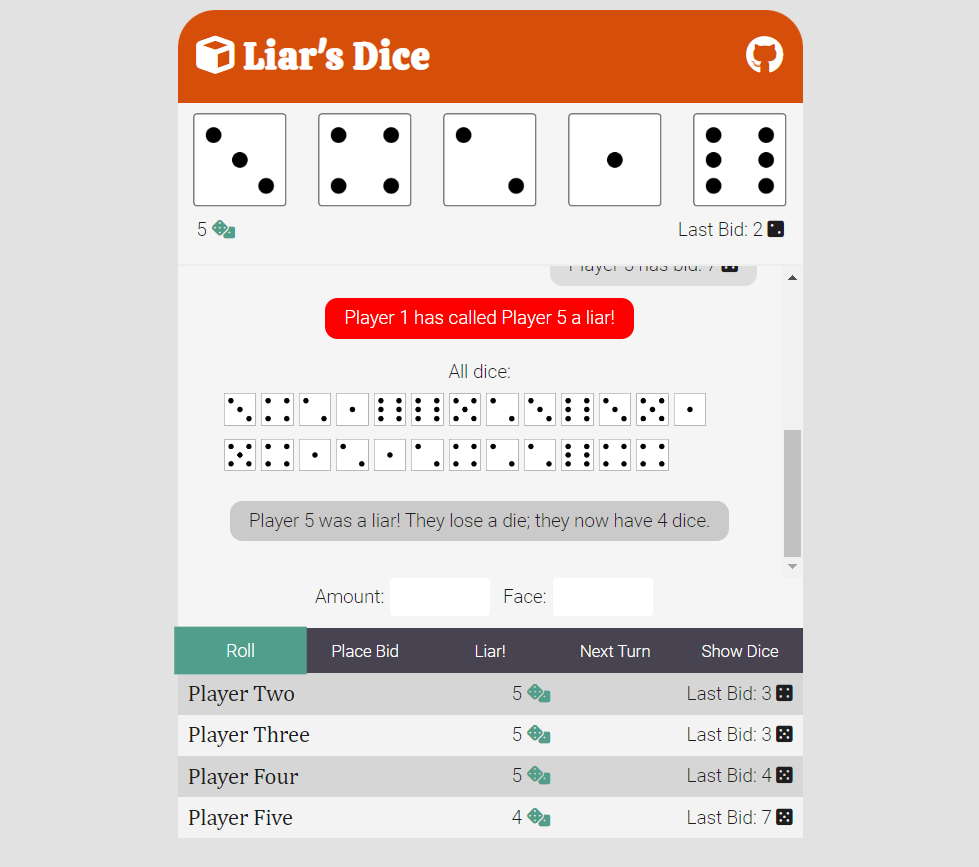

# :game_die: Liar's Dice

Liar's Dice is a classic dice game with at least two players. Each player is given five dice, which they must keep hidden from other players. 

### :page_with_curl: Rules

The rules are simple: each player places a bid in turn, declaring how many of a certain face they believe is on the table between all the players. For example, the first player could bid "One Two", meaning they think there is only one die showing the face "two" on the table. 

Then, the next player bids. At least the 'amount' or 'face' bid must be higher than the last player's bid. For example, if the last bid was "One Two", valid bids would include "Two Twos", "One Three", "Two Threes", "Four Ones", etc.

Any player can choose to call "Liar!" on the previous player instead of placing a bid. This means they believe the last bid to be incorrect. When a player calls "Liar!", all the dice on the table are shown. If the accused was indeed wrong (a liar), they lose a die. If the accusor was wrong, they lose a die.

The game continues in this fashion until only one player has dice remaining.

When the game reaches two players with only one die each, they bid instead on the sum of both faces.

### :memo: Progress & to-do
- add an end-game event (to start new game)
- change the game when there are 2 players with 1 die each remaining
- implement the 'exact' rule ()
- would like to improve the layout
- need to make the layout responsive to all screen sizes

### :computer: Try a demo!
Please enjoy a live demo of the project <a href="https://devlarabar.github.io/liars-dice/">here</a>!